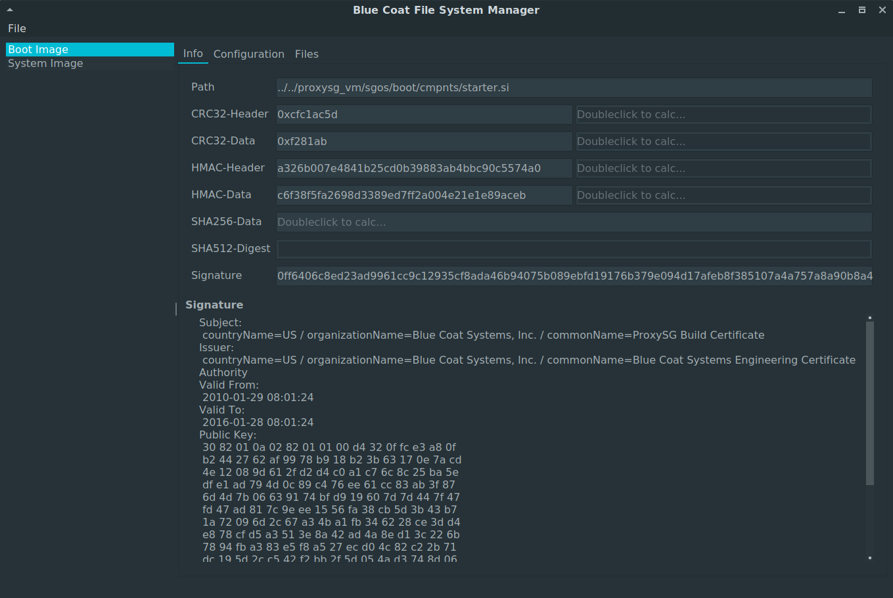
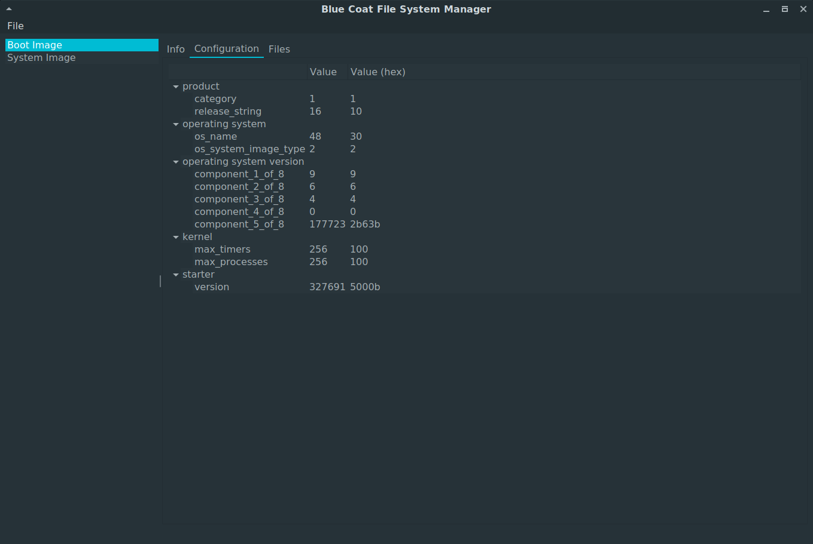
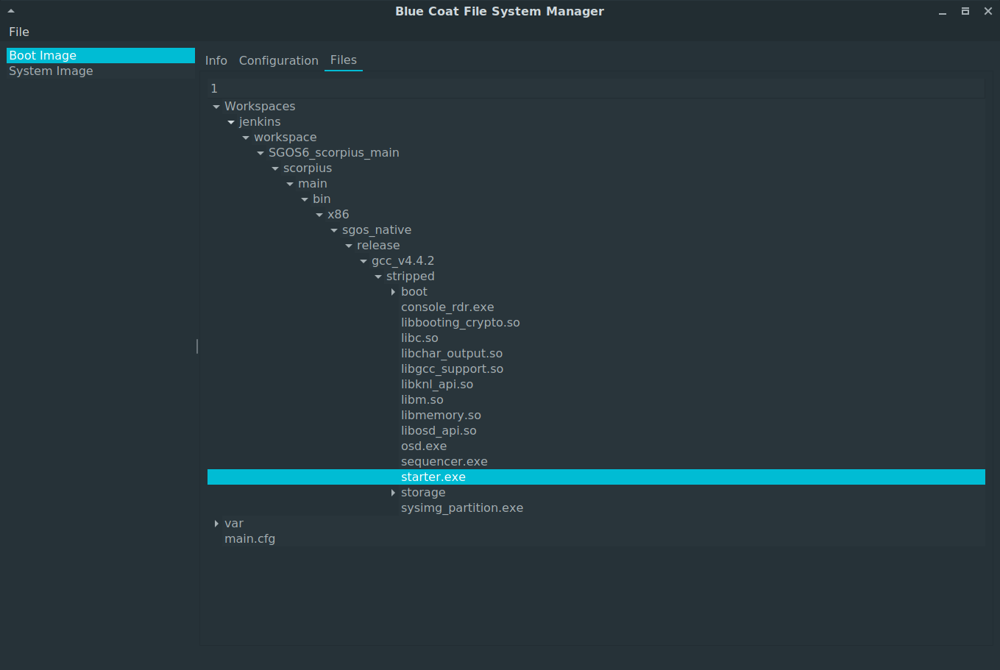

# BlueCoat Filesystem Manager

Features so far

- os configuration viewer
- image signature viewer & creator
- folder viewer

## Dependencies

- openssl
- Python 3 (tested with 3.5 and 3.6)
    - PyQt5
    - cryptography
    - pyelftools

## Usage

1. mount FAT32 partition (e.g. from a virtual appliance)

    1. via vmware:
        ```
        $ mkdir proxysg
        $ vmware-mount ProxySG-SWG-V100-disk1.vmdk proxysg
        ```

    2. via virtualbox:
        ```
        $ mkdir proxysg
        $ VBoxManage clonehd disk ProxySG-SWG-V100-disk1.vmdk ProxySG-SWG-V100-disk1.raw --format RAW
        $ mount -o loop ProxySG-SWG-V100-disk1.raw proxysg
        ```

2. Run tools:
    ```
    $ bcfs-manager
    ```

3. Open mounted directory

## Screenshots




